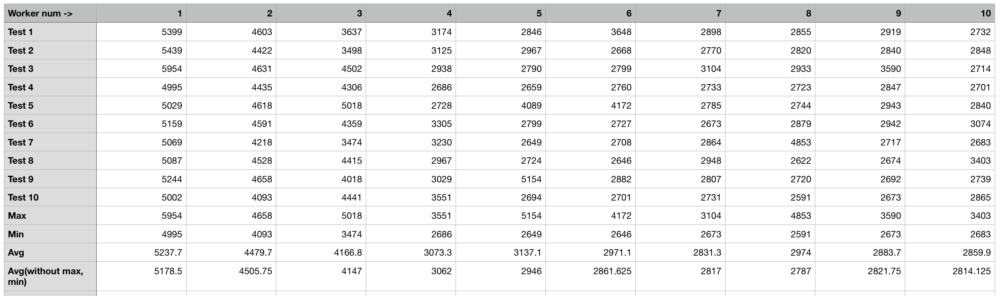

# epub-viewer

epub file viewer android application

## Preview
- TODO : 앱의 기능 설명, 스크린샷 추가

## Structure
- TODO : 기본 구조 추가

## Paginator
가상의 WebView를 통해 렌더링 될 내용의 길이를 구하고 그를 통해 페이지수를 계산합니다.

### Performance
`BEYOND GOOD AND EVIL.epub` 파일로 worker 갯수별 퍼포먼스 체크를 하였습니다.
- 테스트 기기 : Galaxy S8
- 테스트 파일 : `BEYOND GOOD AND EVIL.epub`

(worker 갯수 별 수행 시간, 단위 : ms)