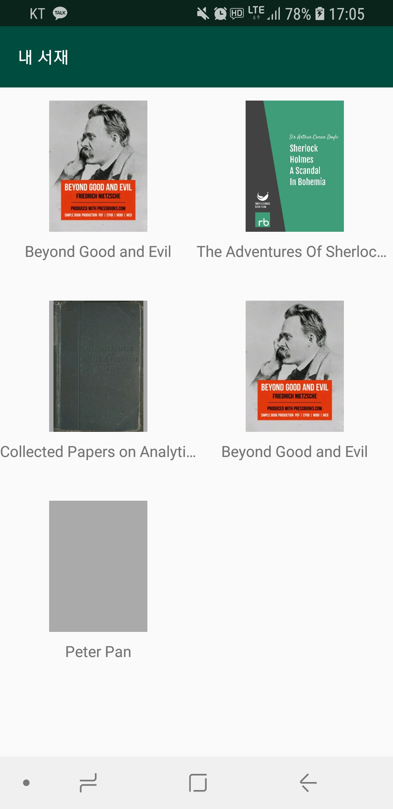
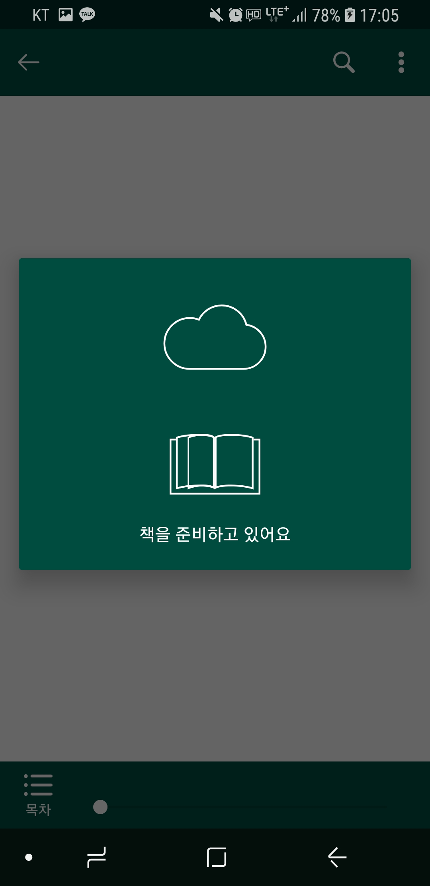

# epub-viewer
[](https://travis-ci.org/JSpiner/epub-viewer)
[](https://www.codacy.com/app/jspiner/epub-viewer?utm_source=github.com&amp;utm_medium=referral&amp;utm_content=JSpiner/epub-viewer&amp;utm_campaign=Badge_Grade)

epub file viewer android application

## Preview
|  | |  |
|:---:|:---:|:---:|
|  |  |  |

## Spec
- DRM 없는 EPUB 파일 열람
- EPUB 콘텐츠의 처음부터 끝까지 볼 수 있어야함
- 뷰어 내에서 EPUB 파일에 포함되어 있는 책 제목, 저자명, 목차 목록 등이 표시되어야함
- 목차 목록에서 목차 선택 시 해당 위치로 이동이 가능해야함
- Slider 혹은 Seek bar 형태의 UI를 통한 네비게이션이 가능해야함
- 스크롤 보기, 페이지 넘겨 보기 방식이 모두 가능해야함
    - 중간에 보기 방식을 전환할 때 보던 위치가 반드시 유지될 필요는 없음
- (추가스펙) 본문 내 검색 기능
- (추가스펙) 보기 방식 전환 시 보던 위치 유지

## Structure
```
└── net
    └── jspiner
        └── epub_viewer
            ├── dto
            │   ├── Epub.kt
            │   ├── PageInfo.kt
            │   └── ViewerType.kt
            ├── paginator
            │   ├── PagePaginator.kt
            │   ├── Paginator.kt
            │   └── ScrollPaginator.kt
            ├── ui
            │   ├── base
            │   │   ├── BaseActivity.kt
            │   │   ├── BaseFragment.kt
            │   │   ├── BaseView.kt
            │   │   ├── BaseViewModel.kt
            │   │   └── EpubWebClient.kt
            │   ├── common
            │   │   └── LoadingDialog.kt
            │   ├── etc
            │   │   ├── EtcActivity.kt
            │   │   └── EtcViewModel.kt
            │   ├── library
            │   │   ├── LibraryActivity.kt
            │   │   ├── LibraryAdapter.kt
            │   │   ├── LibraryViewHolder.kt
            │   │   └── LibraryViewModel.kt
            │   └── reader
            │       ├── ReaderActivity.kt
            │       ├── ReaderViewModel.kt
            │       ├── toolbox
            │       │   └── ToolboxView.kt
            │       └── viewer
            │           ├── EpubLoadingView.kt
            │           ├── EpubPagerAdapter.kt
            │           ├── EpubView.kt
            │           ├── ScrollStatus.kt
            │           ├── VerticalViewPager.kt
            │           └── WebContainerFragment.kt
            └── util
                ├── BindingAdapter.kt
                ├── LazyUtil.kt
                ├── LifecycleTransformer.kt
                └── ViewUtil.kt


```
- `ui/library` : 서재 페이지
- `ui/reader` : 뷰어 페이지
- `ui/etc` : 기타 페이지


## Paginator
가상의 WebView를 통해 렌더링 될 내용의 길이를 구하고 그를 통해 페이지수를 계산합니다.

### ScrollPaginator
WebView를 통해 컨텐츠를 렌더링하고 scroll height를 구합니다.

#### Performance
`BEYOND GOOD AND EVIL.epub` 파일로(약 300쪽) worker 갯수별 퍼포먼스 체크를 하였습니다.
- 테스트 기기 : Galaxy S8
- 테스트 파일 : `BEYOND GOOD AND EVIL.epub`


(worker 갯수 별 수행 시간, 단위 : ms)

### PagePaginator
html body를 잘라 하나씩 추가해보며 '디바이스 높이' 단위로 페이지를 분할합니다.

#### Performance
`BEYOND GOOD AND EVIL.epub` 파일로(약 300쪽) worker 갯수별 퍼포먼스 체크를 하였습니다.

- 처음부터 1단어씩 추가하는 방식 : 42s
- 이진탐색으로 변경후 : 9s
- 탐색방식 최적화후 : 7s
- javascript interface 최소화후 : 5s